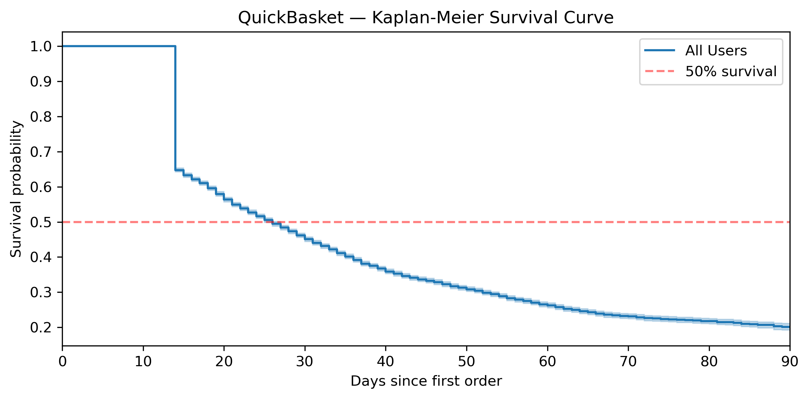
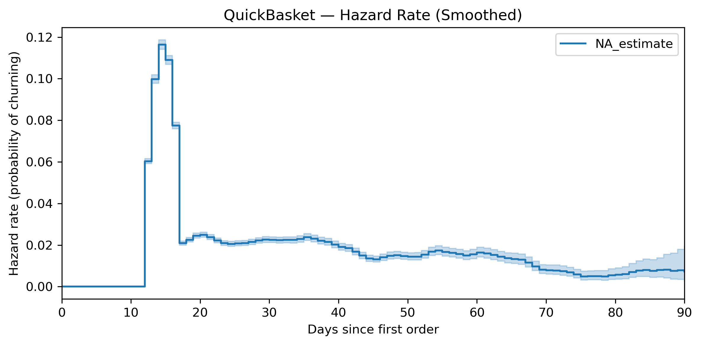
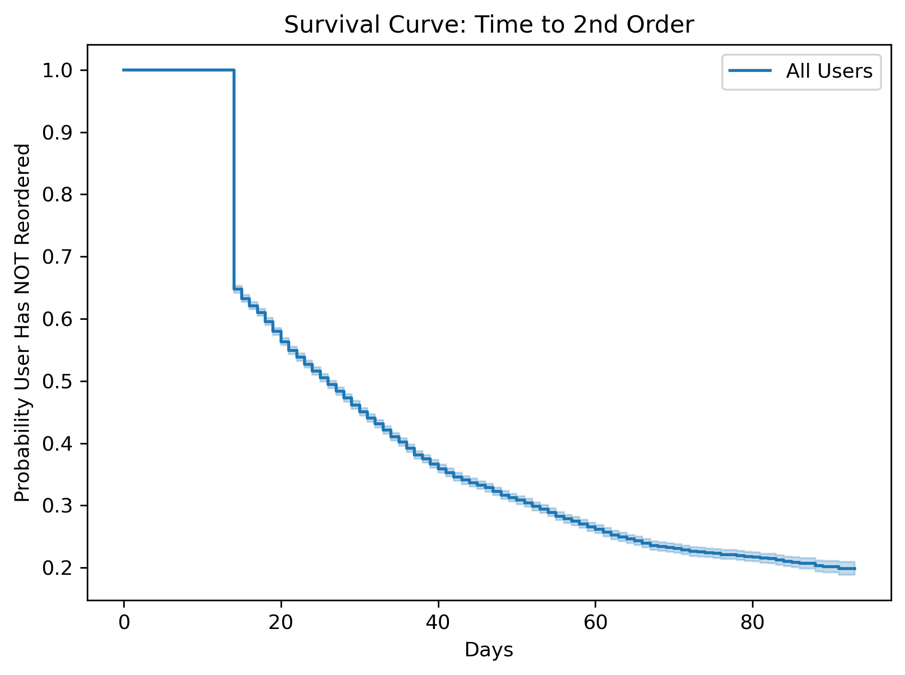

# QuickBasket — Habit Formation & Retention Analysis

**Diagnosing why 60% of first-time buyers never return — and designing the intervention to fix it.**

---

## Context

QuickBasket is a quick-commerce grocery delivery app operating across 8 Indian metros, promising 10–20 minute delivery of daily essentials. The company launched in October 2024 and scaled aggressively through Q1 2025 — acquiring 52,000 new users across January, February, and March.

Acquisition is healthy. Activation is healthy (63% of signups place their first order). But the business has a retention problem: most users order once and never come back.

This project investigates **where users drop off, why it happens, and what to do about it** — using cohort analysis, behavioral segmentation, survival analysis, and impact sizing.

---

## The Core Question

> Are newly acquired users forming weekly ordering habits? If not, where exactly are we losing them, and what's driving the drop-off?

---

## What the Analysis Revealed

### 1. The Week-1 cliff is the biggest leak

60–75% of first-time buyers do not place a second order within their first week. This one transition — from first order to second order — is where the business loses the majority of its users.

### 2. But habits do form for those who survive

Users who order consecutively for 4 weeks start retaining at 85–91% week-over-week. The product works. The habit loop exists. The problem is not product-market fit — it's that too few users survive the first month to reach the habit-locked phase.

### 3. The discount expectation cliff is the root cause

Users who never returned received higher first-order discounts (24%) compared to users who formed habits (13%). The welcome discount sets an artificially high value perception. When the second order reverts to near-full price, the perceived value drops and users leave.

This is reinforced by behavioral data: habit formers placed 3.2 orders in their first week with an average basket of Rs.315. Non-returners placed just 1.5 orders with Rs.276 baskets. The depth of first-week engagement — not just the first order — predicts who stays.

### 4. This is a product problem, not a channel problem

The pattern holds across every acquisition channel — organic, paid, referral, influencer. Return rates vary by channel (referral at 42% vs influencer at 30%), but the mechanism of churn is identical everywhere. Fixing this requires changing the post-first-order experience, not reallocating marketing spend.

### 5. Day 0–14 is the intervention window

Survival analysis confirms that the risk of churn peaks sharply at Day 14–18 — five to six times higher than any other point in the user lifecycle. After Day 21, the hazard rate flattens. Median user survival is just 26 days. If you don't engage a user within the first two weeks, they're gone.

---

## Survival Analysis

### Kaplan-Meier Survival Curve

Half of all activated users churn within 26 days of their first order. By Day 84, only 21% remain active.

### Hazard Rate

The probability of churning peaks at Day 14–18. There is no secondary spike — the entire retention challenge concentrates in this single window.

### Time-to-Reorder Survival

65% of users haven't placed a second order by Day 7. The reorder window effectively closes by Day 14, and flatlines by Day 40.

---

## Recommendation

**Test a free delivery incentive on the second order** — nudge sent on Day 3 after first purchase, valid until Day 7.

Why this specific intervention:
- It targets the W0–W1 transition, where the largest volume of users is lost
- It removes friction (delivery fee) without creating discount dependency
- It acts within the Day 0–14 window that survival analysis identified as critical
- It encourages a second order experience, which is the strongest predictor of continued engagement
- It costs approximately Rs.30 per user — low risk with high potential upside

Impact sizing shows that a 5 percentage point improvement in the 7-day return rate (37% to 42%) would generate approximately 500 additional retained users per month, translating to Rs.7–12 lakh in net monthly revenue.

**The A/B experiment testing this intervention is documented here:**  
[quickcommerce-retention-ab-test](https://github.com/rasaanjps0309/quickcommerce-retention-ab-test)

---

## Analytical Methods

| Analysis | What it answers |
|---|---|
| Time to first order | How quickly do users activate after signup? |
| Time to second order | How long before users come back — and how many never do? |
| Weekly cohort retention | What does the retention curve look like across cohorts? |
| Rolling consecutive retention | Are users forming genuine weekly habits? |
| First order experience comparison | What about the first order predicts whether a user returns? |
| Habit former behavioral profile | What do 4-week survivors look like vs early drop-offs? |
| Channel quality analysis | Is the retention problem worse in specific channels? |
| Kaplan-Meier survival analysis | When exactly do users churn, statistically? |
| Hazard rate analysis | At what point is churn risk highest? |
| Impact sizing | If we fix W1 retention, what's the revenue impact? |

---

## Data

Synthetic dataset modeled after Indian quick-commerce benchmarks. Three tables covering 52,000 users, 136,000 orders, and 16,000 event summary records across January–April 2025. Distributions are calibrated to realistic patterns for city mix, channel quality, discount behavior, retention curves, and operational metrics.

---

## Tech Stack

PostgreSQL (pgAdmin) · Python (pandas, lifelines, scipy) · Jupyter Notebook · Claude AI · NotebookLM

---

**Payel Saha** 
Retention analytics, habit formation, and lifecycle strategy for consumer tech.
